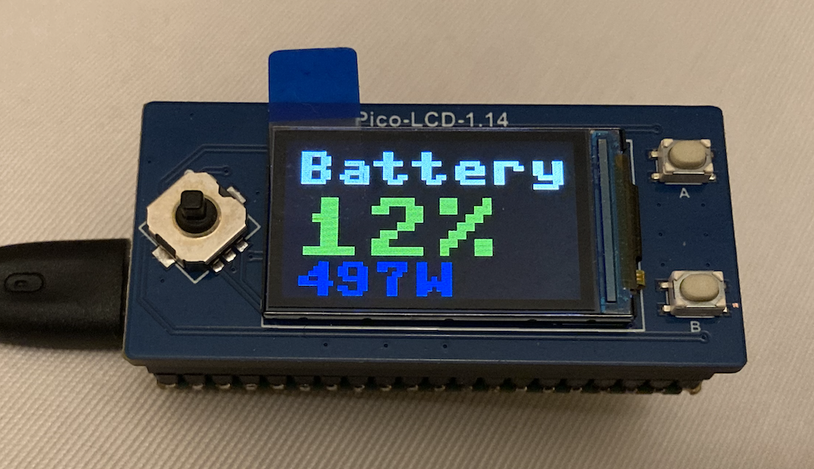

# GivNgy_PicoLCD_lgFont
Micropython script to interrogate GivEnergy API, and display battery status on 1.14" Pico LCD with custom large font.

Requires a secrets.py file with WLAN SSID, Password, and GivEnergy invertor ID, and authorization token

Borrows heavily from https://github.com/dhargopala/pico-custom-font for the large font solution for the little screen
